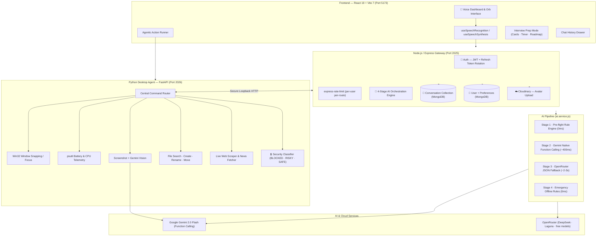
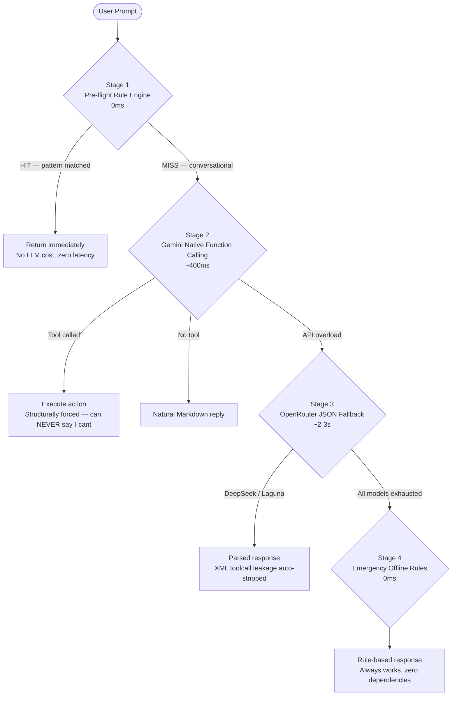

# 🌸 Cheeni AI — Voice-First Agentic Desktop Assistant

<div align="center">



[](https://nodejs.org)
[](https://python.org)
[](https://react.dev)
[](https://vitejs.dev)
[](https://ai.google.dev)
[](https://vitest.dev)
[](LICENSE)

**Cheeni** is a voice-first, agentic AI desktop companion that actually controls your laptop — opens apps, plays YouTube videos, checks battery, and answers any question — with a warm, witty personality powered by Google Gemini native function calling.

[Features](#-features) • [Architecture](#-system-architecture) • [AI Pipeline](#-4-stage-ai-pipeline) • [Quick Start](#-quick-start) • [Testing](#-testing) • [Voice Commands](#-supported-voice-commands)

</div>

---

## ✨ Features

| Category | Capability |
|---|---|
| 🎙️ **Voice-First** | High-fidelity speech recognition, silence detection, live transcription, sweet TTS voice |
| ⚡ **OS Control** | Opens apps, plays YouTube, adjusts volume, snaps windows, checks battery — all automatically |
| 🧠 **AI Intelligence** | 4-stage hybrid pipeline: Pre-flight rules → Gemini Function Calling → OpenRouter → Offline |
| 👁️ **Screen Vision** | *"What's on my screen?"* — captures screenshot & analyzes with Gemini multimodal vision |
| 🎓 **Interview Prep** | DSA/System Design flashcards, mock interview timer, topic roadmap tracker |
| 🧠 **User Memory** | Remembers preferences: response style, target goal, languages, custom instructions |
| 📁 **File Intelligence** | Search files, read documents, create/rename/move folders via voice |
| 🌐 **Web Intelligence** | Scrape live content, fetch latest news, search the web on command |
| 📊 **Analytics** | Weekly tool invocations, voice talk-time, topic frequency dashboards |
| 🌓 **Themes** | Adaptive dark/light mode with system preference auto-detection |

---

## 🏗️ System Architecture



---

## 🧠 4-Stage AI Pipeline

The heart of Cheeni — a resilient, zero-failure response chain that delivers instant actions while maintaining intelligent conversation.



### Stage routing reference

| Stage | Catches | Latency |
|---|---|---|
| **Pre-flight** | `play X on youtube`, `open notepad`, `check battery`, `watch X on youtube` | **0 ms** |
| **Gemini FC** | `open dhanda newly wala song on youtube`, ambiguous/complex requests | **~400 ms** |
| **OpenRouter** | When Gemini quota exhausted or overloaded | **~2–3 s** |
| **Offline** | Zero internet / total connectivity failure | **0 ms** |

---

## 🚀 Quick Start

### Prerequisites

| Tool | Version |
|---|---|
| Windows | 10 / 11 (64-bit) |
| Node.js | 18+ |
| Python | 3.10+ |
| MongoDB | Local `27017` or Atlas URI |

### 1-Click Launch

```cmd
start_cheeni.bat
```

Starts all three services and opens Cheeni in your browser:

1. 🐍 Python Desktop Agent → `http://127.0.0.1:2026`
2. ⚙️ Node.js Backend → `http://localhost:2025`
3. ⚛️ Vite Frontend → `http://localhost:5173`

---

### Manual Setup

#### 1. Backend (Node.js / Express)

```bash
cd backend
npm install
cp .env.example .env
npm run dev
```

**Required `.env` keys:**

```env
PORT=2025
MONGO_URI=mongodb://localhost:27017/cheeni
JWT_SECRET=your_super_secret_key
GEMINI_API_KEY=your_gemini_key          # Primary — Gemini Function Calling
OPENROUTER_API_KEY=your_openrouter_key  # Fallback — DeepSeek / Laguna
ALLOWED_ORIGINS=http://localhost:5173   # CORS whitelist
CLOUDINARY_CLOUD_NAME=...
CLOUDINARY_API_KEY=...
CLOUDINARY_API_SECRET=...
```

#### 2. Python Desktop Agent

```bash
cd cheeni-agent
python -m venv venv
venv\Scripts\activate
pip install -r requirements.txt
python main.py
```

#### 3. Frontend (React + Vite)

```bash
cd frontend
npm install
npm run dev
```

---

## 🧪 Testing

**21 tests passing** across three layers.

### Frontend Hook Tests (Vitest + Testing Library)

Tests `useSpeechRecognition`, `useSpeechSynthesis`, voice cleaner, mute toggle:

```bash
cd frontend && npm run test
# ✓ 12 tests passing
```

### Backend API Integration Tests (Supertest + Vitest)

Tests auth flows, JWT, protected routes, agent proxy, rate limiting:

```bash
cd backend && npm run test
# ✓ 9 tests passing
```

### Python Agent Functional Tests (Pytest)

Tests security classifier, intent detection, router, FastAPI endpoints:

```bash
cd cheeni-agent
pytest tests/test_phase3.py tests/test_phase4.py tests/test_phase6.py -v
```

---

## 🤖 Supported Voice Commands

| Category | Examples |
|---|---|
| 🎵 **YouTube** | `play song of arijit singh` · `open kesariya on youtube` · `play python tutorial on youtube` |
| 🖥️ **Apps** | `open notepad` · `launch calculator` · `open vscode` · `open file explorer` |
| 🔋 **System** | `check battery` · `what time is it` · `system specs` |
| 🔊 **Volume** | `set volume to 60` · `mute audio` · `turn up the volume` |
| 🪟 **Windows** | `minimize window` · `maximize` · `snap left` · `snap right` |
| 🌐 **Web** | `search google for react hooks` · `search youtube for DSA tutorial` |
| 📁 **Files** | `search for a file named resume` · `create folder Projects` |
| 👁️ **Vision** | `what's on my screen` · `analyze my screen` |
| 💬 **AI Chat** | `explain binary search` · `give me a DSA mock question` |

---

## ⌨️ Keyboard Shortcuts

| Shortcut | Action |
|---|---|
| <kbd>Space</kbd> / <kbd>Alt</kbd>+<kbd>M</kbd> | Toggle microphone |
| <kbd>Escape</kbd> | Stop speech / close modals |
| <kbd>Ctrl</kbd>+<kbd>K</kbd> | Focus prompt input |
| <kbd>Ctrl</kbd>+<kbd>Shift</kbd>+<kbd>H</kbd> | Toggle chat history drawer |

---

## 📁 Project Structure

```
cheeni/
├── start_cheeni.bat             # 1-click launcher
│
├── frontend/                    # React 19 + Vite 7
│   ├── src/components/home/     # Orb, Navbar, StatusBar, Toolbar
│   ├── src/hooks/               # useSpeechRecognition, useSpeechSynthesis
│   ├── src/pages/               # Home, Auth, Prep, Analytics
│   ├── src/utils/actionRunner.js
│   └── src/hooks/*.test.js      # Vitest unit tests
│
├── backend/                     # Node.js / Express 5
│   ├── services/ai.service.js   # 4-stage AI pipeline + Gemini FC
│   ├── controllers/             # assistant, auth, user
│   ├── model/                   # User (preferences), Conversation, FlaggedPrompt
│   ├── middlewares/             # JWT, rate limiting, sanitization
│   └── tests/                   # Supertest integration tests
│
└── cheeni-agent/                # Python FastAPI desktop agent
    ├── tools/router.py          # Central router (21+ intents)
    ├── security/                # BLOCKED / RISKY / SAFE classifier
    ├── tools/                   # Volume, Window, Files, Web, Vision
    └── tests/                   # Pytest functional suites
```

---

## 🔒 Security

- **Rate Limiting** — `express-rate-limit` per-user per-route, prevents Gemini quota abuse
- **CORS Whitelist** — `ALLOWED_ORIGINS` env var, never hardcoded localhost
- **JWT + Refresh Rotation** — Access tokens in-memory (XSS safe), server-side revoke via `tokenVersion`
- **Prompt Injection Defense** — `sanitizeUserInput()` + structural LLM isolation
- **Security Classifier** — Every desktop command classified `SAFE / RISKY / BLOCKED` before execution
- **Avatar Upload Validation** — MIME type + 5 MB limit enforced before Cloudinary upload
- **Flagged Prompt Logging** — Async DB logging of detected injection patterns
- **Local Loopback Only** — Desktop agent bound to `127.0.0.1:2026` exclusively

---

## 🛠️ Tech Stack

### Frontend
| Library | Version | Purpose |
|---|---|---|
| React | 19.2 | UI framework |
| Vite | 7.2 | Build tool / Dev server |
| Framer Motion | 14.0 | Animations |
| Axios | 1.13 | HTTP client |
| Vitest + Testing Library | 3.2 | Unit testing |

### Backend
| Library | Version | Purpose |
|---|---|---|
| Express | 5.1 | HTTP server |
| @google/genai | 2.23 | Gemini Function Calling |
| Mongoose | 9.0 | MongoDB ODM |
| Cloudinary | 2.8 | Avatar storage |
| express-rate-limit | 8.7 | Rate limiting |
| Vitest + Supertest | 3.2 | Integration testing |

### Python Desktop Agent
| Library | Purpose |
|---|---|
| FastAPI + Uvicorn | Local HTTP server |
| psutil | Battery / CPU / RAM telemetry |
| pygetwindow | Window focus & snapping |
| pycaw | Audio volume control |
| Pillow | Screenshot capture |
| pytest | Functional testing |

---

## 📄 License

Licensed under the [ISC License](LICENSE).

---

<div align="center">

Built with ❤️ by **Naitik** &nbsp;|&nbsp; Powered by **Google Gemini 2.0 Flash**

</div>
