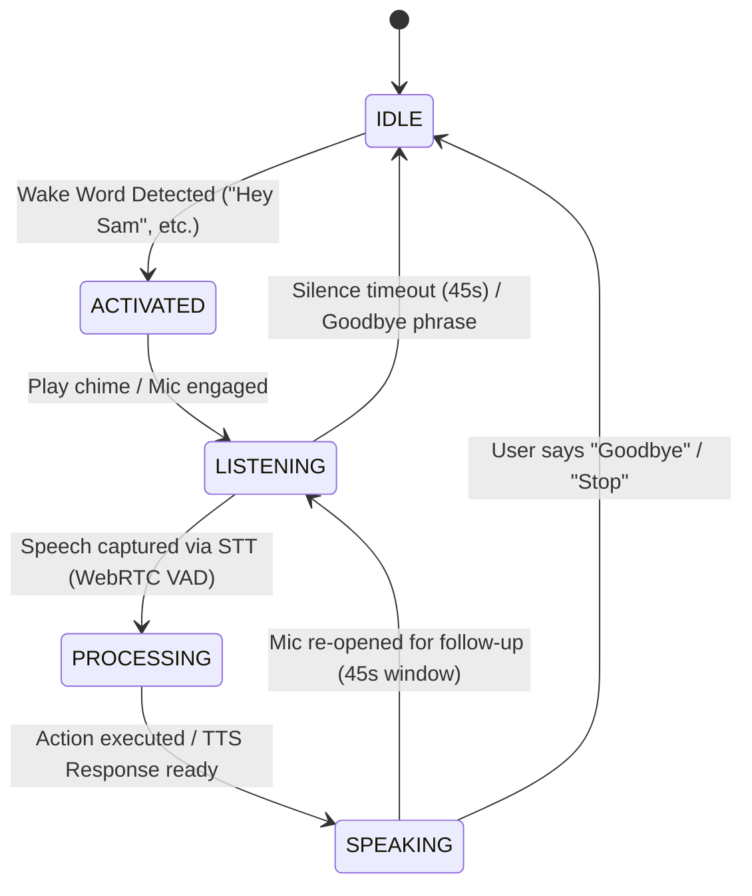
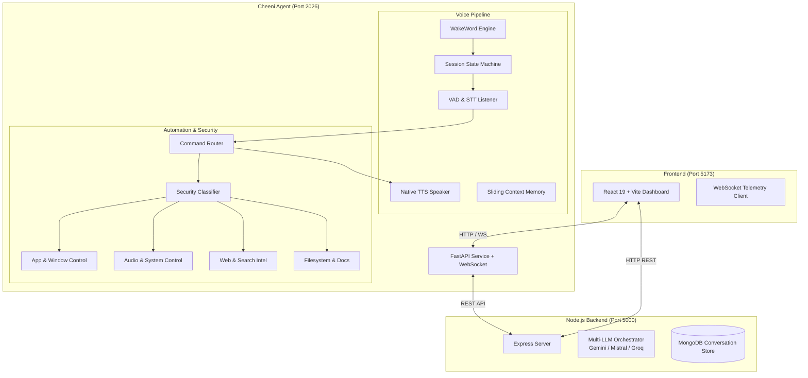

<div align="center">

# 🍯 CHEENI (Sam Desktop Agent)

### Autonomous AI Desktop Agent & 2-Way Hands-Free Voice Assistant

[](https://react.dev/)
[](https://nodejs.org/)
[](https://python.org/)
[](https://fastapi.tiangolo.com/)
[](LICENSE)
[](https://microsoft.com/windows)

**Cheeni** is an intelligent, privacy-first desktop assistant engineered for Windows. Powered by multi-LLM orchestration, real-time wake word detection, hands-free 2-way continuous conversation, native system automation, and a glassmorphism dashboard.

[Features](#-key-features) • [Voice Pipeline](#-hands-free-voice-pipeline) • [Architecture](#-architecture) • [Getting Started](#-getting-started) • [Voice Commands](#-voice-interaction--commands) • [Tech Stack](#-tech-stack)

---

</div>

## 🌟 Key Features

| Feature | Description |
|---|---|
| 🗣️ **2-Way Continuous Voice** | Hands-free Alexa/Siri-style conversation loop: Wake Word → Listen → Process → Speak → Follow-up loop. |
| 👂 **Phonetic Wake Word Engine** | Background acoustic listening with 50+ phonetic variants for names like **"Sam"**, **"Cheeni"**, **"Khushi"**, and configurable aliases. |
| 🧠 **Multi-LLM Intelligence** | Seamless fallback chain: OpenRouter (Direct LLM) → Local Python Command Router → Node.js Multi-Provider AI (Gemini, Mistral, Groq, Cohere, DeepSeek). |
| 🛡️ **Execution Security Guard** | 3-tier action security classifier (`SAFE`, `RISKY`, `BLOCKED`) protecting against dangerous shell commands and file destruction. |
| 🖥️ **Native System Control** | Application launching & closing, window tiling/minimizing/focusing, master audio control & muting, system telemetry (CPU, RAM, Battery). |
| 🌐 **Live Web Intelligence** | DuckDuckGo search integration, web page content extraction, summarization, and live browsing. |
| 📁 **File & Document Reader** | File search, directory exploration, and automated parsing for `.txt`, `.pdf`, and `.docx` documents. |
| ⚡ **Real-time Glassmorphism UI** | React 19 + Vite dashboard featuring WebSocket telemetry, live audio visualizer, conversation transcript, quick action triggers, and dark mode. |

---

## 🎙️ Hands-Free Voice Pipeline

Cheeni implements an autonomous, non-blocking 2-way conversational state machine that runs locally on Windows:



### Voice Components
- **Wake Word Engine (`voice/wakeword.py`)**: Uses energy thresholding and fuzzy phonetic matching in background threads (`listen_in_background`), listening for configured keywords without hogging CPU.
- **Speech-to-Text (`voice/listener.py`)**: WebRTC VAD voice activity detection combined with Google STT (tuned with `pause_threshold=0.6s` for conversational speed).
- **Text-to-Speech (`voice/speaker.py`)**: High-performance, non-blocking `pyttsx3` native Windows speech synthesizer (Microsoft Zira / David) with thread-safe queue management.
- **Session Manager (`voice/session.py`)**: Thread-safe state tracker emitting real-time WebSocket state broadcasts (`IDLE`, `ACTIVATED`, `LISTENING`, `PROCESSING`, `SPEAKING`).
- **Sliding Memory (`voice/memory.py`)**: Tracks rolling multi-turn conversation context (default 10 turns) so follow-ups retain context.
- **LLM Fallback Router (`voice/conversation.py`)**:
  1. **Direct Fast LLM**: Queries OpenRouter (`inclusionai/ling-3.0-flash-sante:free` or user choice) for low latency.
  2. **Local Tool Router**: Matches system tasks directly (volume, apps, windows, stats).
  3. **Backend Fallback**: Delegates complex tasks to the Node.js assistant orchestrator.

---

## 🏗️ Architecture



---

## 🚀 Getting Started

### Prerequisites
- **OS**: Windows 10 or 11 (required for native Windows audio and window control APIs)
- **Node.js**: v18.0 or higher
- **Python**: 3.10+
- **MongoDB**: Local or Atlas connection URI

### 1. Installation

Clone the repository and install all dependencies:

```bash
git clone https://github.com/wraith-klu/Cheeni.git
cd Cheeni

# 1. Install Node.js Backend dependencies
cd backend
npm install

# 2. Install Frontend dependencies
cd ../frontend
npm install

# 3. Setup Python Agent environment
cd ../cheeni-agent
python -m venv venv
venv\Scripts\activate
pip install -r requirements.txt
```

### 2. Environment Configuration

Create `.env` files in each project directory:

#### **Node Backend** (`backend/.env`):
```env
PORT=5000
MONGODB_URI=mongodb://localhost:27017/cheeni
JWT_SECRET=your_jwt_secret_key
GEMINI_API_KEY=your_gemini_api_key
GROQ_API_KEY=your_groq_api_key
MISTRAL_API_KEY=your_mistral_api_key
```

#### **Python Agent** (`cheeni-agent/.env`):
```env
PORT=2026
AGENT_NAME=Sam
BACKEND_URL=http://localhost:5000
OPENROUTER_API_KEY=your_openrouter_api_key
OPENROUTER_MODEL=inclusionai/ling-3.0-flash-sante:free
CONVERSATION_MEMORY_TURNS=10
AUTO_START_VOICE=true
VOICE_RATE=185
VOICE_VOLUME=1.0
DEBUG=false
```

#### **Frontend** (`frontend/.env`):
```env
VITE_BACKEND_URL=http://localhost:5000
VITE_AGENT_URL=http://localhost:2026
VITE_AGENT_WS_URL=ws://localhost:2026/ws
```

### 3. Launching the Entire System

Run the consolidated Windows batch script to launch all 3 microservices simultaneously:

```bash
# In the root directory:
start_cheeni.bat
```

Or run them individually in separate terminals:

```bash
# Terminal 1: Node.js Backend
cd backend && npm run dev

# Terminal 2: Cheeni Python Agent
cd cheeni-agent && venv\Scripts\activate && uvicorn main:app --host 0.0.0.0 --port 2026 --reload

# Terminal 3: Vite Frontend
cd frontend && npm run dev
```

Visit **http://localhost:5173** to view the live dashboard.

---

## 🗣️ Voice Interaction & Commands

### Wake Word
Simply speak naturally into your microphone:
- *"Hey Sam"* / *"Hi Sam"* / *"Okay Sam"*
- Supported phonetics: `Sam`, `Sem`, `Saem`, `Shyam`, `Khushi`, `Cheeni`
- *(Configurable via `AGENT_NAME` in `.env`)*

### Example Natural Language Commands
- **App Management**:
  - *"Open Chrome and launch Spotify"*
  - *"Close Notepad"*
  - *"Bring VS Code to front"*
- **Audio & Media Control**:
  - *"Mute audio"* / *"Set volume to 40 percent"*
  - *"Turn up the volume"*
- **System Telemetry**:
  - *"What is my CPU usage?"*
  - *"Check my battery status and RAM usage"*
- **Web & Information**:
  - *"Search DuckDuckGo for the latest SpaceX launch"*
  - *"Summarize the current news about artificial intelligence"*
- **Document Reading**:
  - *"Read the file notes.txt on my desktop"*
  - *"Summarize report.pdf in Documents"*
- **Conversation Termination**:
  - *"Goodbye"*, *"Bye Sam"*, *"Stop listening"*, *"Sleep"*

---

## 🛡️ Security System

Cheeni includes a built-in safety gate (`cheeni-agent/security/command_security.py`) to prevent catastrophic OS changes:

- 🟢 **SAFE**: Reading system metrics, audio volume adjustment, window focus, standard application launching.
- 🟡 **RISKY**: Modifying configuration files, batch operations, web scraping unknown domains.
- 🔴 **BLOCKED**: Format drive commands, modifying Windows registry, deletion of critical directories (`System32`, `Program Files`), destructive bash/cmd script execution.

---

## 🧰 Tech Stack

| Domain | Technologies & Libraries |
|---|---|
| **Frontend** | React 19, Vite, Tailwind CSS, Lucide React, WebSocket API |
| **Backend** | Node.js, Express.js, MongoDB (Mongoose), JWT, Axios |
| **Agent Core** | Python 3.10+, FastAPI, Uvicorn, Pydantic, WebSockets |
| **Voice & Speech** | `SpeechRecognition`, `pyttsx3`, `webrtcvad`, `sounddevice`, `pyaudio` |
| **Automation** | `pywin32`, `pyautogui`, `psutil`, `pycaw`, `comtypes` |
| **Intelligence** | OpenRouter, Google Gemini, Groq, Mistral, DuckDuckGo Search, BeautifulSoup4 |
| **Document Parsing**| `PyPDF2`, `python-docx` |

---

## 📂 Project Directory Structure

```text
Cheeni/
├── backend/                      # Node.js Express server
│   ├── src/
│   │   ├── controllers/          # Chat and user controllers
│   │   ├── routes/               # API endpoint definitions
│   │   ├── services/             # Multi-LLM provider connectors
│   │   └── index.js              # Server entry point
│   └── package.json
│
├── frontend/                     # React 19 + Vite dashboard
│   ├── src/
│   │   ├── components/           # VoiceVisualizer, SystemStats, ChatWindow, etc.
│   │   ├── context/              # Agent WebSocket and state contexts
│   │   └── App.jsx
│   └── package.json
│
├── cheeni-agent/                 # Native Python Desktop Agent
│   ├── voice/                    # 2-way conversation pipeline
│   │   ├── wakeword.py           # Background wake word listener
│   │   ├── listener.py           # WebRTC VAD + STT engine
│   │   ├── speaker.py            # Non-blocking TTS synthesizer
│   │   ├── session.py            # Conversational state machine
│   │   ├── memory.py             # Sliding context window
│   │   └── conversation.py       # Main continuous conversation loop
│   ├── tools/                    # Native Windows automation
│   │   ├── router.py             # Command parser and tool dispatcher
│   │   ├── app_control.py        # Launch/kill/focus processes
│   │   ├── window_control.py     # Win32 window management
│   │   ├── volume_control.py     # Pycaw audio level control
│   │   ├── system_status.py      # Psutil CPU/RAM/Battery metrics
│   │   ├── web_intelligence.py   # Web search and scraping
│   │   └── filesystem_control.py # Document reading and file ops
│   ├── security/                 # Security boundary checker
│   ├── main.py                   # FastAPI service and WebSocket server
│   └── requirements.txt
│
├── start_cheeni.bat              # One-click start script
└── README.md
```

---

## 🤝 Contributing

Contributions, issues, and feature requests are welcome! Feel free to check the [issues page](https://github.com/wraith-klu/Cheeni/issues).

---

<div align="center">

Built with ❤️ by **[Naitik](https://github.com/wraith-klu)**

</div>
