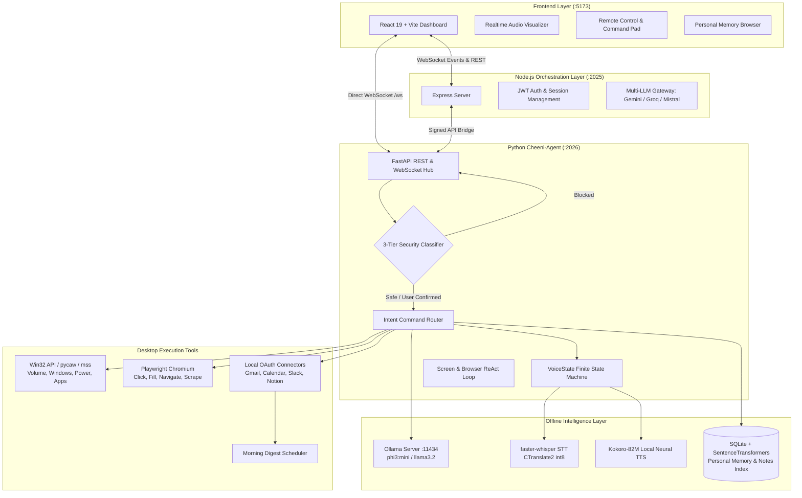
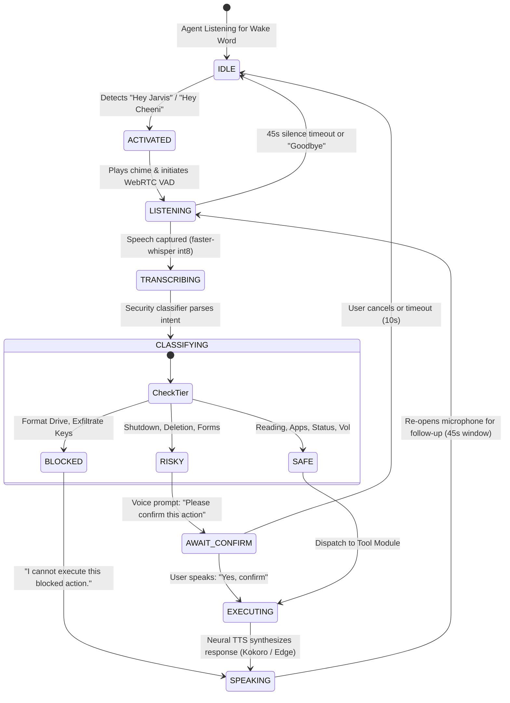
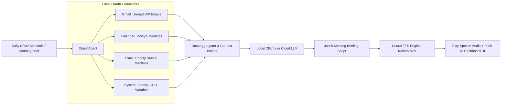

<!-- markdownlint-disable MD033 MD051 -->
# 🍯 CHEENI — Personal JARVIS Desktop AI Assistant

## Full-Featured, Local-First, Autonomous AI Desktop Assistant & Voice Operating Agent

**Tony Stark spent a billion dollars on his. You need zero rupees.**

<div align="center">

[](https://react.dev/)
[](https://nodejs.org/)
[](https://python.org/)
[](https://fastapi.tiangolo.com/)
[](https://ollama.ai/)
[](https://playwright.dev/)
[](https://github.com/SYSTRAN/faster-whisper)
[](LICENSE)
[](https://microsoft.com/windows)

[Key Features](#what-is-cheeni) • [Architecture Diagrams](#system-architecture--diagrams) • [OpenJarvis 5-Step Guide](#openjarvis-zero-rupee-setup-guide) • [Getting Started](#getting-started) • [Voice & Commands](#voice-interaction--commands) • [Security Guard](#3-tier-execution-security-guard) • [Tech Stack](#technology-stack)

---

</div>

<a id="what-is-cheeni"></a>
## 🌟 What is Cheeni?

**Cheeni** is an open-source, local-first personal AI assistant built for everyday laptops. Inspired by Stanford's OpenJarvis framework, it runs entirely on your own hardware without mandatory cloud subscriptions, while offering optional cloud LLM bridges for heavy lifting.

It combines an always-on **low-power wake word detector**, **sub-second local speech-to-text** via `faster-whisper`, a **multi-backend fallback LLM router** (Ollama ↔ OpenRouter ↔ Gemini ↔ Node.js), **neural voices** (Edge-TTS & Kokoro-82M), **browser automation** via Playwright, **screen vision grounding** with Gemini 2.0 Flash, **local OAuth connectors** for Gmail, Calendar, Slack, and Notion, and an automated **Jarvis morning brief engine**.

---

<a id="system-architecture--diagrams"></a>
## 📊 System Architecture & Diagrams

### 1. Multi-Tier Distributed Ecosystem


```mermaid
graph TB
    subgraph Client_UI ["Frontend Layer (:5173)"]
        UI[React 19 + Vite Dashboard]
        VoiceVisualizer[Realtime Audio Visualizer]
        RemotePad[Remote Control & Command Pad]
        MemoryViewer[Personal Memory Browser]
    end

    subgraph Node_Bridge ["Node.js Orchestration Layer (:2025)"]
        ExpressServer[Express Server]
        UserAuth[JWT Auth & Session Management]
        CloudOrchestrator[Multi-LLM Gateway: Gemini / Groq / Mistral]
    end

    subgraph Agent_Sidecar ["Python Cheeni-Agent (:2026)"]
        FastAPIServer[FastAPI REST & WebSocket Hub]
        SecurityGate{3-Tier Security Classifier}
        CentralRouter[Intent Command Router]
        VoiceFSM[VoiceState Finite State Machine]
        ReActEngine[Screen & Browser ReAct Loop]
    end

    subgraph Local_Intelligence ["Offline Intelligence Layer"]
        OllamaEngine[Ollama Server :11434<br/>phi3:mini / llama3.2]
        WhisperSTT[faster-whisper STT<br/>CTranslate2 int8]
        KokoroTTS[Kokoro-82M Local Neural TTS]
        VectorDB[(SQLite + SentenceTransformers<br/>Personal Memory & Notes Index)]
    end

    subgraph Local_Tooling ["Desktop Execution Tools"]
        WinAutomation[Win32 API / pycaw / mss<br/>Volume, Windows, Power, Apps]
        BrowserAgent[Playwright Chromium<br/>Click, Fill, Navigate, Scrape]
        Connectors[Local OAuth Connectors<br/>Gmail, Calendar, Slack, Notion]
        DigestScheduler[Morning Digest Scheduler]
    end

    UI <-->|WebSocket Events & REST| ExpressServer
    UI <-->|Direct WebSocket /ws| FastAPIServer
    ExpressServer <-->|Signed API Bridge| FastAPIServer

    FastAPIServer --> SecurityGate
    SecurityGate -->|Safe / User Confirmed| CentralRouter
    SecurityGate -->|Blocked| FastAPIServer

    CentralRouter --> VoiceFSM
    VoiceFSM --> WhisperSTT
    VoiceFSM --> KokoroTTS

    CentralRouter --> OllamaEngine
    CentralRouter --> VectorDB
    CentralRouter --> WinAutomation
    CentralRouter --> BrowserAgent
    CentralRouter --> Connectors
    Connectors --> DigestScheduler
```

---

### 2. Conversational Voice Pipeline


```mermaid
stateDiagram-v2
    [*] --> IDLE: Agent Listening for Wake Word

    IDLE --> ACTIVATED: Detects "Hey Jarvis" / "Hey Cheeni"
    ACTIVATED --> LISTENING: Plays chime & initiates WebRTC VAD
    LISTENING --> TRANSCRIBING: Speech captured (faster-whisper int8)
    TRANSCRIBING --> CLASSIFYING: Security classifier parses intent

    state CLASSIFYING {
        [*] --> CheckTier
        CheckTier --> SAFE: Reading, Apps, Status, Vol
        CheckTier --> RISKY: Shutdown, Deletion, Forms
        CheckTier --> BLOCKED: Format Drive, Exfiltrate Keys
    }

    RISKY --> AWAIT_CONFIRM: Voice prompt: "Please confirm this action"
    AWAIT_CONFIRM --> EXECUTING: User speaks: "Yes, confirm"
    AWAIT_CONFIRM --> IDLE: User cancels or timeout (10s)
    BLOCKED --> SPEAKING: "I cannot execute this blocked action."

    SAFE --> EXECUTING: Dispatch to Tool Module
    EXECUTING --> SPEAKING: Neural TTS synthesizes response (Kokoro / Edge)
    SPEAKING --> LISTENING: Re-opens microphone for follow-up (45s window)
    LISTENING --> IDLE: 45s silence timeout or "Goodbye"
```

---

### 3. Morning Brief & Connector Aggregation Pipeline


```mermaid
flowchart LR
    Schedule[Daily 07:00 Schedule / 'Morning brief'] --> Engine[DigestAgent]

    subgraph DataConnectors ["Local OAuth Connectors"]
        Engine --> Gmail[Gmail: Unread VIP Emails]
        Engine --> GCal[Calendar: Today's Meetings]
        Engine --> Slack[Slack: Priority DMs & Mentions]
        Engine --> Sys[System: Battery, CPU, Weather]
    end

    Gmail --> Aggregator[Data Aggregator & Context Builder]
    GCal --> Aggregator
    Slack --> Aggregator
    Sys --> Aggregator

    Aggregator --> LLM[Local Ollama or Cloud LLM]
    LLM --> Script[Jarvis Morning Briefing Script]
    Script --> VoiceEngine[Neural TTS Engine: Kokoro-82M]
    VoiceEngine --> SpokenAudio[Play Spoken Audio + Push to Dashboard UI]
```

---

## ⚡ Complete 20-Phase Capability Matrix

| Phase | Module | Capabilities & Technology Stack | Latency | Local / Cloud |
| :--- | :--- | :--- | :--- | :--- |
| **V1** | `tools/app_control.py` | Launch, kill, and focus any Windows application (Chrome, Notepad, VS Code). | < 200ms | 100% Local |
| **V2** | `core/server.py` | FastAPI asynchronous REST bridge with Bearer auth and Pydantic v2 schemas. | < 50ms | 100% Local |
| **V3** | `tools/system_status.py` | Battery, CPU, RAM metrics, master audio volume (`pycaw`), lock, sleep, shutdown. | < 100ms | 100% Local |
| **V4** | `tools/file_operations.py` | Sandboxed search & parsing for `.pdf`, `.docx`, `.txt` in Desktop/Docs/Downloads. | < 300ms | 100% Local |
| **V5** | `tools/web_intelligence.py` | DuckDuckGo search, real-time news aggregation, web page scraping with BeautifulSoup4. | ~1.2s | Cloud Search |
| **V6** | `voice/wakeword.py` | Ultra-low power wake word detection (`openwakeword`, ONNX `hey_jarvis` model). | < 50ms | 100% Local |
| **V7** | `tools/window_control.py` | Minimize, maximize, restore, split-screen snap (left/right/top/bottom), virtual desktops. | < 150ms | 100% Local |
| **V8** | `tools/desktop_vision.py` | Multi-screen capture (`mss`), image compression, and Google Gemini 2.0 Flash Vision. | ~1.5s | Hybrid |
| **V9** | `voice/conversation.py` | Full duplex 2-way conversation loop with WebRTC VAD and session memory. | Realtime | 100% Local |
| **V10** | `voice/whisper_listener.py` | `faster-whisper` transformer STT (CTranslate2 int8) for noise-tolerant transcription. | ~0.8s | 100% Local |
| **V11** | `tools/browser_agent.py` | Playwright browser automation (navigate, click elements, fill forms, extract text). | ~1.0s | 100% Local |
| **V12** | `tools/screen_agent.py` | ReAct vision loop (observe ➔ plan ➔ act) with UI element grounding and click automation. | ~2.5s/step | Hybrid |
| **V13** | `voice/edge_speaker.py` | Microsoft Edge neural TTS with sentiment tone modulation (neutral, excited, calm, stern). | ~600ms | Cloud API |
| **V14** | `core/llm_router.py` | Offline LLM router with fallback chain: Node.js ➔ OpenRouter ➔ Gemini ➔ Ollama. | ~2.0s | 100% Local |
| **V15** | `core/personal_memory.py` | Persistent SQLite memory with `all-MiniLM-L6-v2` semantic vector search. | < 80ms | 100% Local |
| **V16** | `frontend/AgentDashboard.jsx` | React 19 glassmorphism dashboard with WebSocket telemetry, memory manager & remote pad. | Realtime | 100% Local |
| **V17** | `tools/digest_agent.py` | Automated morning briefing engine reading Gmail, Calendar, Slack, and system status. | ~3.0s | Hybrid |
| **V18** | `tools/connectors.py` | Local-first OAuth2 connectors for Gmail, Google Calendar, Slack, and Notion. | < 500ms | Local Auth |
| **V19** | `voice/kokoro_speaker.py` | Kokoro-82M local neural voice generator (Jarvis British `bm_george` and American voices). | ~400ms | 100% Local |
| **V20** | `tools/notes_indexer.py` | Semantic RAG vector indexer for personal `.md`, `.txt`, `.pdf` note directories. | < 100ms | 100% Local |

---

<a id="openjarvis-zero-rupee-setup-guide"></a>
## 🚀 OpenJarvis Zero-Rupee Setup Guide

Build your own JARVIS on your laptop in 5 simple steps with zero rupees and 100% open-source software.

### Step 1: Install Dependencies

```powershell
# 1. Clone repository
git clone https://github.com/wraith-klu/Cheeni.git
cd Cheeni

# 2. Python agent setup
cd cheeni-agent
python -m venv venv
.\venv\Scripts\Activate.ps1
pip install -r requirements.txt
playwright install chromium
```

### Step 2: Run a Local Model with Ollama

1. Download Ollama from [ollama.ai](https://ollama.ai) and start it.

2. Pull a fast local model:

   ```bash
   ollama run phi3:mini
   # Or for high-capacity laptops:
   ollama run llama3.2:3b
   ```

### Step 3: Give It a Voice

Configure your `cheeni-agent/.env` to use the offline neural stack:

```env
WAKE_WORD_ENGINE=openwakeword
WAKE_WORD_MODEL=hey_jarvis
WHISPER_MODEL_SIZE=base
WHISPER_DEVICE=cpu
WHISPER_COMPUTE_TYPE=int8
TTS_ENGINE=kokoro
KOKORO_VOICE=bm_george
KOKORO_SPEED=1.05
```

### Step 4: Connect Your Tools (Gmail, Calendar, Slack, Notion)

Trigger local OAuth in your terminal:

```bash
# Link Google Workspace (Gmail + Calendar)
curl -X POST http://localhost:2026/api/connectors/connect -H "Content-Type: application/json" -d '{"service":"gdrive"}'
```

*Your browser will launch Google's OAuth consent screen. Credentials are saved locally on your laptop in `data/connectors/`.*

### Step 5: Schedule Your Morning Briefing

Set your daily morning briefing for 7:00 AM:

```bash
curl -X POST http://localhost:2026/api/digest/schedule -H "Content-Type: application/json" -d '{"time":"07:00"}'
```

Every morning at 7:00 AM, Jarvis will address you by name, summarize your urgent emails, lay out today's schedule, and provide system stats.

---

<a id="getting-started"></a>
## 🛠️ Getting Started

### Prerequisites

- **OS**: Windows 10 or 11 (64-bit)
- **Node.js**: v18.0 or higher
- **Python**: 3.10 or 3.11
- **MongoDB**: Local instance or free MongoDB Atlas cluster

---

### Environment Configuration

#### 1. Node.js Backend (`backend/.env`)

```env
PORT=2025
MONGODB_URI=mongodb://localhost:27017/cheeni
JWT_SECRET=your_super_secret_jwt_key
AGENT_API_TOKEN=cheeni_secret_token_32_characters_long_min
GEMINI_API_KEY=your_gemini_api_key
GROQ_API_KEY=your_groq_api_key
MISTRAL_API_KEY=your_mistral_api_key
```

#### 2. Python Agent (`cheeni-agent/.env`)

```env
PORT=2026
AGENT_NAME=Sam
AGENT_API_TOKEN=cheeni_secret_token_32_characters_long_min
BACKEND_URL=http://localhost:2025

# Offline LLM
OLLAMA_HOST=http://localhost:11434
OLLAMA_MODEL=phi3:mini
OLLAMA_ENABLED=true

# Voice Pipeline
WAKE_WORD_ENGINE=openwakeword
WHISPER_MODEL_SIZE=base
WHISPER_DEVICE=cpu
WHISPER_COMPUTE_TYPE=int8
TTS_ENGINE=edge
EDGE_VOICE=en-IN-NeerjaNeural

# Digest Configuration
DIGEST_TIMEZONE=Asia/Kolkata
DIGEST_HONORIFIC=sir
DIGEST_SECTIONS=calendar,gmail,system
```

#### 3. React Frontend (`frontend/.env`)

```env
VITE_BACKEND_URL=http://localhost:2025
VITE_AGENT_URL=http://localhost:2026
VITE_AGENT_WS_URL=ws://localhost:2026/ws
```

---

### Launching the System

#### Option A: One-Click Windows Launch Script

Double-click `start_cheeni.bat` in the project root to start all 3 services simultaneously.

#### Option B: Manual Terminal Execution

```powershell
# Terminal 1: Node.js Backend
cd backend
npm run dev

# Terminal 2: Cheeni Python Agent
cd cheeni-agent
.\venv\Scripts\Activate.ps1
python main.py

# Terminal 3: Vite React Frontend
cd frontend
npm run dev
```

Visit **`http://localhost:5173`** for the main dashboard and **`http://localhost:5173/agent`** for the JARVIS Remote Control Center.

---

<a id="voice-interaction--commands"></a>
## 🗣️ Voice Interaction & Commands

### Wake Word Phrases

The system continuously listens in low-power background mode:

- *"Hey Jarvis"* / *"Hey Sam"* / *"Hi Cheeni"* / *"Wake up Sam"* / *"Suno Cheeni"*

### Example Voice Commands

#### System & Volume

- *"Set volume to 50 percent"*
- *"Mute sound"* / *"Unmute"*
- *"Check my battery and CPU usage"*
- *"Lock my computer"* (Tier 1 Safe)
- *"Shut down my laptop"* (Tier 2 Risky ➔ Prompts for verbal confirmation)

#### Window Management & Tiling

- *"Snap this window to the left"*
- *"Split screen right"*
- *"Maximize this window"* / *"Minimize everything"*
- *"Switch to the next desktop"*

#### Screen Vision & GUI Interaction

- *"Look at my screen and explain what error is showing"*
- *"Click on the Save button in Notepad"*
- *"Type 'Cheeni AI is live' in the text field"*

#### Browser Automation

- *"Open YouTube and search for lofi music"*
- *"Navigate to github.com and check notifications"*

#### Morning Brief & Personal Memory

- *"Jarvis, give me my morning brief"*
- *"What's on my calendar today?"*
- *"Remember that my college portal is kluniversity.in"*
- *"Where is my college portal?"*
- *"Search my notes for machine learning algorithms"*

---

<a id="3-tier-execution-security-guard"></a>
## 🛡️ 3-Tier Execution Security Guard

Cheeni enforces a strict gatekeeper (`cheeni-agent/security/command_security.py`) to prevent unauthorized or destructive operations:

```text
┌────────────────────────────────────────────────────────────────────────┐
│                        3-TIER SECURITY POLICY                          │
├────────────────────────────────────────────────────────────────────────┤
│ 🟢 TIER 1 - SAFE (Executes Immediately)                                │
│   • Opening registered applications (Notepad, Chrome, VS Code)         │
│   • Adjusting master volume, muting/unmuting                           │
│   • Reading CPU, RAM, battery, datetime metrics                        │
│   • Window snapping, minimizing, maximizing                            │
│   • Reading approved document directories (Desktop/Documents)          │
│   • Speaking morning briefs, playing music                             │
├────────────────────────────────────────────────────────────────────────┤
│ 🟡 TIER 2 - RISKY (Requires Explicit Verbal or UI Confirmation)        │
│   • Shutting down, restarting, or sleeping the computer               │
│   • Deleting, moving, or renaming local files                          │
│   • Submitting online forms or clicking checkout buttons               │
│   • Sending emails or dispatching Slack messages                       │
├────────────────────────────────────────────────────────────────────────┤
│ 🔴 TIER 3 - BLOCKED (Permanently Denied)                               │
│   • Formatting disks or executing destructive diskpart commands        │
│   • Accessing SSH private keys or Windows password vaults              │
│   • Unauthorized fund transfers or crypto transactions                │
└────────────────────────────────────────────────────────────────────────┘
```

---

<a id="verification--testing-suite"></a>
## 🧪 Verification & Testing Suite

Cheeni includes a comprehensive test suite covering all modules:

```powershell
cd cheeni-agent
.\venv\Scripts\Activate.ps1
pytest tests/test_v17_v18_v19_v20.py -v
```

```text
======================= 35 passed in 59.29s =======================
✅ TestV17MorningDigest: Singleton, status, cron scheduling, text brief
✅ TestV18Connectors: OAuth registry, Gmail/Calendar/Slack/Notion mocks
✅ TestV19KokoroTTS: Local neural speaker, speed clamps, voice presets
✅ TestV20NotesIndexer: Directory chunking, SQLite vector storage, RAG search
✅ TestV17_V20_ServerRoutes: FastAPI route registration & Bearer security
```

---

<a id="technology-stack"></a>
## 🧰 Technology Stack

```text
Client Layer:       React 19, Vite, Tailwind CSS, Lucide React, WebSockets, HTML5 Canvas
Orchestration:      Node.js 18+, Express.js, MongoDB (Mongoose), JWT, Axios
Agent Sidecar:      Python 3.10+, FastAPI, Uvicorn, Pydantic v2, WebSockets
Voice & STT:        openwakeword (ONNX), faster-whisper (CTranslate2), WebRTC VAD
Speech Synthesis:   Kokoro-82M Local Neural TTS, Microsoft Edge-TTS, pyttsx3
Intelligence:       Ollama (phi3, llama3.2), Google Gemini 2.0 Flash, OpenRouter
Automation:         Playwright Chromium, pywin32, pyautogui, pycaw, mss, psutil
Semantic Memory:    SQLite 3, sentence-transformers (all-MiniLM-L6-v2), scikit-learn
Connectors:         Google OAuth2 (Gmail, Calendar), Slack SDK, Notion API
```

---

<a id="project-structure"></a>
## 📂 Project Structure

```text
Cheeni/
├── backend/                      # Node.js Express Orchestrator (:2025)
│   ├── src/controllers/          # Chat, user, and agent controllers
│   ├── src/services/             # Multi-LLM provider connectors
│   └── package.json
│
├── frontend/                     # React 19 + Vite Dashboard (:5173)
│   ├── src/components/           # VoiceVisualizer, SystemStats, ChatWindow
│   ├── src/pages/                # AgentDashboard.jsx (V16 Remote Control UI)
│   └── package.json
│
├── cheeni-agent/                 # Python Desktop Agent Sidecar (:2026)
│   ├── core/
│   │   ├── server.py             # FastAPI REST & WebSocket Server (1500+ lines)
│   │   ├── llm_router.py         # Multi-backend fallback LLM router (V14)
│   │   ├── personal_memory.py    # SQLite + SentenceTransformer memory (V15)
│   │   └── react_agent.py        # ReAct loop tool orchestrator
│   ├── tools/
│   │   ├── router.py             # Central command router & regex parser
│   │   ├── app_control.py        # Process launcher and manager (V1)
│   │   ├── window_control.py     # Win32 window snapping & workspaces (V7)
│   │   ├── system_status.py      # Battery, CPU, RAM & power control (V3)
│   │   ├── volume_control.py     # Pycaw master & per-app audio (V3)
│   │   ├── file_operations.py    # Sandboxed document parsing (V4)
│   │   ├── web_intelligence.py   # DuckDuckGo search & scraping (V5)
│   │   ├── desktop_vision.py     # Multi-screen capture & Gemini Vision (V8)
│   │   ├── screen_agent.py       # GUI ReAct action loop & grounding (V12)
│   │   ├── browser_agent.py      # Playwright browser automation (V11)
│   │   ├── digest_agent.py       # Morning briefing engine (V17)
│   │   ├── connectors.py         # Gmail, Calendar, Slack, Notion OAuth (V18)
│   │   └── notes_indexer.py      # Semantic vector RAG notes indexer (V20)
│   ├── voice/
│   │   ├── wakeword.py           # openwakeword background listener (V6)
│   │   ├── listener.py           # WebRTC VAD + faster-whisper STT (V9/V10)
│   │   ├── edge_speaker.py       # Microsoft Edge neural TTS (V13)
│   │   ├── kokoro_speaker.py     # Kokoro-82M offline neural TTS (V19)
│   │   └── conversation.py       # Full duplex continuous voice loop (V9)
│   ├── security/                 # 3-Tier Security Classifier & Confirmation Manager
│   ├── data/                     # Local SQLite databases & OAuth credentials
│   └── tests/                    # Pytest verification suites
│
├── JARVIS_BUILD_PLAN.md          # 20-Phase Master Specification & Architecture Guide
├── start_cheeni.bat              # One-click Windows multi-service runner
└── README.md
```

---

## 🤝 Contributing

Contributions are warmly welcomed! Please feel free to open a Pull Request or file an issue on GitHub.

1. Fork the Project
2. Create your Feature Branch (`git checkout -b feature/AmazingJarvisFeature`)
3. Commit your Changes (`git commit -m 'Add AmazingJarvisFeature'`)
4. Push to the Branch (`git push origin feature/AmazingJarvisFeature`)
5. Open a Pull Request

---

## 📜 License

Distributed under the **Apache-2.0 License**. See `LICENSE` for more information.

<div align="center">

Built with ❤️ by **[Wraith](https://github.com/wraith-klu)** & the OpenJarvis Community

</div>
