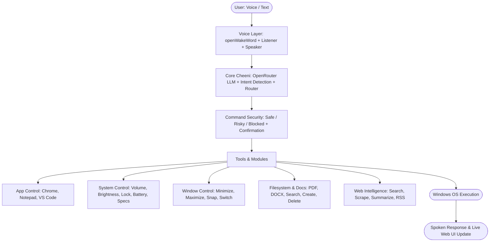

# Cheeni Desktop Agent Architecture (JARVIS V1–V5 Windows Assistant Integration)

Transform Cheeni into a true OS-level agentic AI for your Windows laptop by integrating the complete **JARVIS (V1–V5)** modular architecture: Hands-free Wake Word, System & App Control, Window Management, File & Document Intelligence, Web Scraping, and Command Security.

---

## Architectural Blueprint (Matching the Diagram)



---

## User Review Required

> [!IMPORTANT]
> **Hybrid Architecture Choice**: Cheeni already has a sleek Web UI (`frontend`) and Express API (`backend`). To give Cheeni real access to Windows OS features (volume via `pycaw`, window manipulation via `pyautogui`, local file searching, app launching, wake word via `openWakeWord`), we will implement a dedicated Python Desktop Agent service (`cheeni-agent/`) that communicates with Cheeni's Node backend and Web UI via a fast local WebSocket/REST bridge.

Review the security measures for critical operations below:

> [!WARNING]
> **Command Security**: In accordance with the diagram's Security layer, any "destructive" actions (file deletion, laptop restart/shutdown, killing critical processes) will be classified as **Risky** and will strictly require explicit voice/UI confirmation ("Are you sure you want to proceed?") before execution.

---

## The 20-Step Implementation Roadmap

### Phase 1: Foundation & Desktop Agent Bridge (V1)

- [ ] **Step 1: Set Up Python Desktop Agent Workspace (`cheeni-agent/`)**
  - Create directory structure: `cheeni-agent/{core, voice, tools, security, config, utils}`.
  - Define `requirements.txt` with dependencies (`psutil`, `pyautogui`, `pycaw`, `PyPDF2`, `python-docx`, `beautifulsoup4`, `fastapi`, `uvicorn`, `websockets`).
- [ ] **Step 2: Build Local Agent API & WebSocket Bridge**
  - Implement FastAPI server running on `http://127.0.0.1:2026` to receive commands from Node.js backend / Web UI.
  - Implement real-time WebSocket connection to stream system status, voice events, and tool execution logs to the Cheeni dashboard.
- [ ] **Step 3: Connect Node Backend to Desktop Agent Service**
  - Add proxy router in Express (`backend/routes/agent.routes.js`) communicating with the Python agent.
  - Automatically detect whether the Desktop Agent is running and display an "OS Agent: Connected 💻" badge in the UI.

---

### Phase 2: Wake Word & Hands-Free Activation (V2)

- [ ] **Step 4: Wake Word Engine (`voice/wakeword.py`)**
  - Implement `openWakeWord` or offline keyword detection for **"Hey Cheeni"** / **"Cheeni"**.
  - Add Voice Activity Detection (VAD) to prevent CPU spikes and manage listening states.
- [ ] **Step 5: Voice Session State & Cooldown Manager**
  - Handle conversation sessions (maintain continuous listening while talking, timeout to idle after silence).
  - Add voice commands for session termination: *"Goodbye"*, *"Bye Cheeni"*, *"Go to sleep"*.
- [ ] **Step 6: High-Fidelity Local Speaker Pipeline (`voice/speaker.py`)**
  - Integrate Kokoro TTS / system voice playback for native Windows alerts when running in the background without the browser active.

---

### Phase 3: Command Security & Routing Engine (V3 Security)

- [x] **Step 7: Command Security Classifier (`security/command_security.py`)**
  - Classify every intent into 3 security tiers:
    - **Safe**: Reading time, searching web, opening apps, taking notes, checking battery.
    - **Risky**: Deleting files, killing tasks, closing unsaved apps, system restart/shutdown.
    - **Blocked**: System file deletion (`System32`), registry modification, shell code injection.
- [x] **Step 8: Interactive Confirmation Loop**
  - When a **Risky** command is detected, Cheeni pauses and prompts: *"This action will delete [file/app]. Are you sure you want to proceed?"*.
  - Awaits explicit voice confirmation (*"Yes / Confirm"* or *"No / Cancel"*).
- [x] **Step 9: Central Command Router (`tools/router.py`)**
  - Dispatches validated intents to specific specialized tool modules with execution timing and error logging.

---

### Phase 4: Windows Application & System Control (V3 Control)

- [x] **Step 10: Application Controller (`tools/app_control.py`)**
  - Launch, switch, and terminate Windows apps: Google Chrome, Notepad, VS Code, Calculator, Spotify, Task Manager, File Explorer, Terminal.
  - Detect installed paths automatically via Windows registry / PATH.
- [x] **Step 11: Windows Audio & Volume Controller (`tools/system_control.py`)**
  - Integrate `pycaw` for real master volume control (e.g. *"Set volume to 50%"*, *"Mute laptop"*, *"Volume up"*).
- [x] **Step 12: Hardware & Battery Health Telemetry**
  - Integrate `psutil` to read real Windows CPU usage, RAM utilization, laptop battery percentage, power plug state, and disk space.
  - Lock PC on command (*"Cheeni, lock my laptop"*).
- [x] **Step 12.1: End-to-End Action Execution Engine & YouTube First Song Auto-Play**
  - Connect Web UI action runner (`actionRunner.js`) to backend `/api/agent/launch`, `/api/agent/open`, and `/api/agent/play` bridge.
  - Automatically resolve first video on YouTube (`&autoplay=1`) for song queries instead of opening raw search page.
  - Launch apps and URLs natively via Windows OS to bypass browser popup blockers.
  - Make action badges clickable for manual re-triggering.
- [x] **Step 12.2: Natural Human Voice Persona (Siri/News Anchor) & Bulletproof Output Parsing**
  - Fix raw JSON leakage into chat UI and subtitle banner; remove unescaped newlines/control characters.
  - Eliminate literal backslash-n (`\n`) and markdown symbols from TTS pronunciation.
  - Dual-mode architecture:
    - `speechText`: Expressive, warm, conversational dialogue (2-4 natural sentences) read aloud with emotion and smooth cadence.
    - `textResponse`: Comprehensive, beautifully structured Markdown (headings, bullet points, bold text) for visual reading.
  - Modern Neural Voice selection prioritizing Microsoft Jenny/Aria (Natural) and Google US/UK English with natural pitch and pacing.

---

### Phase 5: Window Management & GUI Automation (V3 Windows)

- [x] **Step 13: Window Management (`tools/window_control.py`)**
  - Integrate `win32gui` / `pygetwindow`: minimize, maximize, restore, close active window, and list open windows.
- [x] **Step 14: Window Snapping & Desktop Workspace Switching**
  - Snap windows to left/right half, switch virtual desktops, or show desktop (*Win + D*).

---

### Phase 6: Filesystem & Document Intelligence (V4 Files)

- [x] **Step 15: File & Folder Operations (`tools/filesystem_control.py`)**
  - Voice-controlled file management: search files across Desktop, Documents, Downloads; create folders; rename and move files safely.
- [x] **Step 16: Document Reader Engine (`PyPDF2`, `python-docx`)**
  - Extract text from `.pdf`, `.docx`, and `.txt` files.
  - Allow queries like: *"Cheeni, summarize the PDF on my Desktop"* or *"Read the notes file in Downloads"*.
- [x] **Step 17: Filesystem Sandbox & Protection**
  - Restrict file deletion and modifications to user directories; protect OS files.

---

### Phase 7: Web Intelligence & Live Scraping (V5 Web)

- [x] **Step 18: Live Web Search & News Aggregator (`tools/web_intelligence.py`)**
  - Real-time search query execution using DuckDuckGo / Google Search API.
  - RSS feeds & news extraction for current affairs, tech updates, and sports scores.
- [x] **Step 19: Web Content Extractor & Summarizer (`beautifulsoup4`)**
  - Scrape text content from search result links and pass clean context into Cheeni's LLM for accurate, grounded summaries.

---

### Phase 8: Full Integration & Verification

- [x] **Step 20: Unified Dashboard Integration & End-to-End Testing**
  - Connect the Web UI (`Home.jsx`) to display live Desktop Agent metrics (CPU, RAM, Volume, Battery).
  - Add quick buttons for OS tools in the UI.
  - End-to-end smoke test: Wake word activation ➔ App launching ➔ Volume change ➔ PDF reading ➔ Web intelligence search ➔ Safe shutdown confirmation.

---

## Verification Plan

### Automated Tests

- Python unit tests for each module:

```powershell
pytest cheeni-agent/tests/
```

- Tool unit tests for volume control, app launching, PDF reading, and security classification.

### Manual Verification

- Test voice commands:
  1. *"Hey Cheeni, open Notepad and write a reminder"*
  2. *"Set laptop volume to 40 percent"*
  3. *"What is my CPU and RAM usage right now?"*
  4. *"Search for latest AI news and summarize the top article"*
  5. *"Delete [test file]"* ➔ Verify Cheeni triggers confirmation prompt before deleting.
